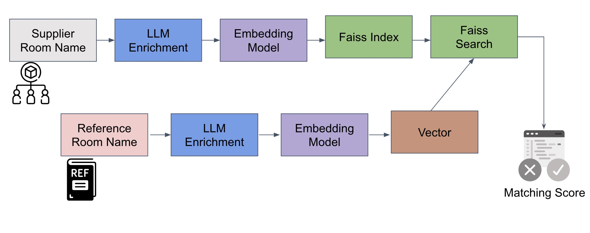
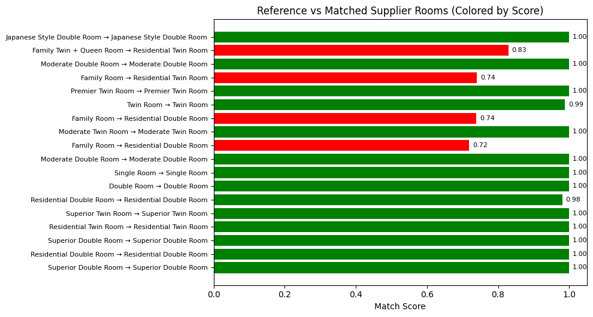

# 🏨 Room Matching using LLMs


<div align="center">
  
</div>

This project matches hotel room names from a **reference** dataset with corresponding room names from a **supplier** dataset using a combination of Large Language Model (LLM) enrichment and vector similarity search.

By generating standardized descriptions for each room and comparing their embeddings, the system accurately identifies equivalent rooms across sources, even when naming conventions differ significantly.


## 🛠 Setup

### 🔧 Dependencies
Install required packages:

```bash
pip install pandas sentence-transformers faiss-cpu groq
```

### 🔑 GroqCloud API Setup
1. Sign up at https://groq.com/groqcloud/ and obtain your API key.

2. Add your API key as an environment variable:

    ✅ In Google Colab:

    Add a secret key under secrets.

    ```python
    from google.colab import userdata
   groq_token=userdata.get('secretName')
    ```
    ✅ Locally: 
    ```python
    import os
    os.environ["GROQ_API_KEY"] = "your-api-key"
    ```
### Data
Intially we have two csv files : 
- For reference properties
- For suppliers


### 📘 Methodology Overview

### 🧹 Data Cleaning and Preprocessing

To prepare the datasets for room matching, we applied several filtering and transformation steps to ensure that the comparison between reference and supplier rooms is meaningful and efficient:

1. **Invalid Room Name Removal**  
   We began by filtering out invalid or unusable room names from the reference dataset. These included entries that were too short, contained meaningless identifiers (e.g., `"Room #39503141"`), or lacked descriptive value. This helped reduce noise before generating embeddings.

2. **Identifying Shared Properties (`lp_id`)**  
   Room data in both datasets is grouped by `lp_id`, which represents a unique property or hotel. We extracted the set of `lp_id`s common to both the reference and supplier datasets to focus only on properties that exist in both sources.

3. **Filtering on Shared Properties**  
   Both the reference and supplier datasets were filtered to retain only rooms belonging to the shared `lp_id`s, ensuring alignment for comparison.

4. **Grouping Room Information by Property**  
   For each shared property, we grouped the relevant room information:
   - From the reference dataset: `room_id` and `room_name`
   - From the supplier dataset: `supplier_room_id`, `supplier_room_name`, and `supplier_name`  
   This grouped data allowed us to handle comparisons at the property level.

5. **Merging and Analyzing Room Counts**  
   The grouped data for each property was merged into a single dataset. We then computed the number of rooms listed for each property in both the reference and supplier datasets. The properties were sorted in descending order by the number of reference rooms to prioritize those with richer data.

6. **Subsampling for Efficient Evaluation**  
   To reduce computational cost particularly the number of LLM API calls we focused our proof of concept (POC) on properties with **between 2 and 29 rooms** from both sources. This provided sufficient complexity for testing while keeping the problem tractable.

7. **Removing Perfect Duplicates Across Sources**  
   Some properties had identical room names between reference and supplier data. While such exact matches are ideal in production, we excluded these cases for the POC in order to test the model’s performance on **non-trivial mappings** (e.g., partial overlaps or slight differences in naming).

8. **Selecting a Representative Example**  
   After filtering, we manually inspected the resulting dataset and selected the property at row `28` as our working example. This specific property includes both matching and mismatching room names across reference and supplier sources, making it an ideal candidate to demonstrate the full pipeline of **room name cleaning** and **description enrichment** via LLM.


---

### 🧠 Model Architecture





#### 1. LLM Enrichement (GroqCloud LLaMA3-70B)

A 70-billion parameter LLM is used to interpret and normalize room names. This large model can infuse domain knowledge, provide additional context, correct errors, and normalize terminology. The choice of a powerful LLM ensures high-quality rewriting of room descriptions, which improves the next step’s effectiveness.

Each raw room name is first cleaned.
We use a **prompt-engineered LLM** (`llama3-70b-8192` via GroqCloud) to generate a structured description for every room.  
The LLM is instructed (via a carefully tuned prompt) to extract key attributes such as:
- Room type
- Bed configuration
- View
- Amenities (e.g. kitchen, non-smoking)
- Floor level and room size (if available)

It returns:
- A normalized `cleaned_name`
- A concise, grammatically correct `description`


#### 2. Embedding Model (all-MiniLM-L6-v2)
We convert the `cleaned_name` and its `description` into vector embeddings using the sentence-transformer model:  
**`all-MiniLM-L6-v2`**  
These embeddings capture the **semantic meaning** of the room and allow us to compare rooms beyond exact wording.

We selected MiniLM for its speed and strong accuracy given its small size (only ~22 MB) which is ideal for real-time matching at scale.


#### 3. FAISS Vector Store:

- **Reference room embeddings** are precomputed and stored (offline).
- **Supplier rooms** are embedded and compared **on the fly** (**online**).

Using **FAISS** allows us to search through thousands of rooms efficiently via similarity search.

---
### Matching Results & Evaluation
We use **cosine similarity** between the embeddings to find the closest supplier match for each reference room.


<div align="center">
  
</div>


- A **high similarity score** indicates a strong match between the room descriptions.
- If multiple supplier rooms yield very close similarity scores, these cases are **flagged for deeper review**.

---
### Next Steps: 
- LLM-based Tie-breaker: Introduce an LLM-driven verification step for ambiguous cases. For example, when the top results have similar scores, an LLM can take the reference description and the top-N supplier descriptions and judge which supplier room best matches the reference (using a specialized prompt). This can further improve precision by handling edge cases with nuanced differences especially when dealing with `cosine`. 

<div align="center">
  
</div>


- Scaling to Multiple Suppliers: This use case only showcases one supplier: `Expedia` but we can enrich the data with more suppliers and see how the model performs to simulate a real life scenario. 
